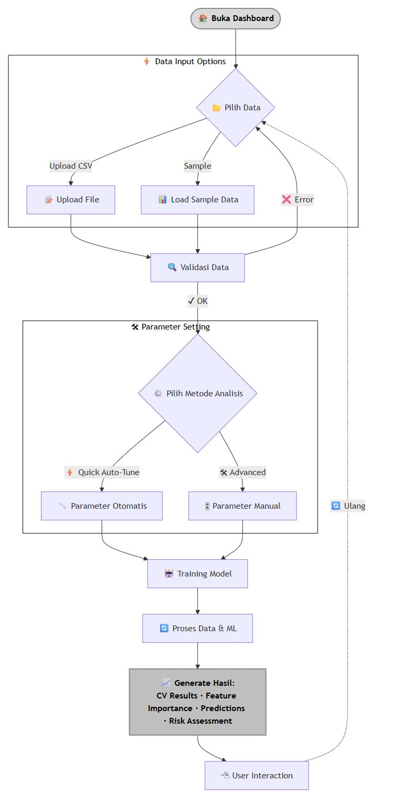
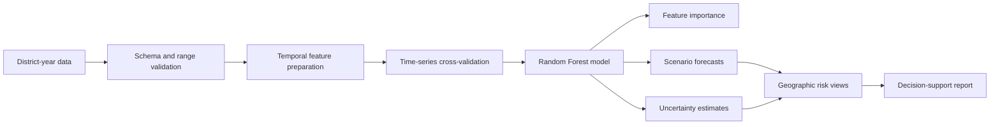

<div align="center">

# Food Security Forecasting

**A time-aware machine-learning workflow for forecasting Indonesian food-security conditions, comparing policy scenarios, and mapping geographic risk.**


</div>



## The decision problem

Food-security risk is shaped by economic, health, education, infrastructure, and demographic signals that change over time. A useful system must preserve temporal order, expose uncertainty, and translate model output into geographic and policy-relevant views.

This project packages that workflow into a Streamlit application and reusable Python modules.

## Dataset at a glance

| Signal | Current repository data |
|---|---:|
| Observations | 889 district-year rows |
| Geographic coverage | 9 provinces · 127 districts/cities |
| Time coverage | 2018–2024 |
| Modeling approach | Random Forest regression |
| Validation strategy | Time-series cross-validation |

The source table combines poverty, food expenditure, clean-water access, female education, health-worker availability, life expectancy, and a composite food-security target.

## Analytical workflow



## What the system delivers

- Automated schema, range, and completeness checks.
- Time-ordered validation instead of random-only model evaluation.
- Random Forest training with configurable parameters.
- Feature-importance analysis for interpreting risk drivers.
- Optimistic, baseline, and pessimistic scenario generation.
- Bootstrap-based uncertainty estimates.
- Province and district-level geographic risk visualizations.
- CSV, JSON, and GeoJSON-oriented export workflows.

## Validation philosophy

The application reports cross-validation performance by fold rather than presenting a single score as universal. This matters because:

- Later years should not leak into earlier training periods.
- Performance can vary across temporal windows.
- Scenario forecasts depend on assumptions, not known future observations.
- Geographic gaps and changing definitions can affect comparability.

The code therefore exposes mean performance, variation between folds, error metrics, and model-stability signals.

## Run locally

Requires Python 3.8 or newer.

```bash
git clone https://github.com/akbaralqahri/food_security_forecasting.git
cd food_security_forecasting

python -m venv .venv
```

Activate the environment:

```bash
# Windows
.venv\Scripts\activate

# macOS / Linux
source .venv/bin/activate
```

Install and start the application:

```bash
pip install -r requirements.txt
streamlit run main.py
```

Open `http://localhost:8501`.

## Expected data contract

Input CSV files should contain:

| Column | Meaning |
|---|---|
| `Provinsi` | Province |
| `Kabupaten` | District/city |
| `Tahun` | Observation year |
| `Kemiskinan (%)` | Poverty rate |
| `Pengeluaran Pangan (%)` | Food-expenditure share |
| `Tanpa Air Bersih (%)` | Population without clean-water access |
| `Lama Sekolah Perempuan (tahun)` | Female years of schooling |
| `Rasio Tenaga Kesehatan` | Health-worker ratio |
| `Angka Harapan Hidup (tahun)` | Life expectancy |
| `Komposit` | Composite food-security target |

## Repository map

```text
main.py                          Streamlit application
src/
  food_security_forecasting.py  modeling and scenario pipeline
  geo_visualization.py          geographic views
  visualization.py              analytical charts
  utils.py                      validation and shared utilities
data/raw/                        source dataset
outputs/                         generated models, figures, and reports
example_usage.py                 programmatic workflow example
setup_guide.md                   extended setup notes
```

## Responsible interpretation

- Forecasts are scenario-based analytical estimates, not official government projections.
- The checked-in sample covers selected provinces rather than all of Indonesia.
- A Random Forest can identify useful nonlinear relationships but does not establish causality.
- Policy decisions should combine model output with local expertise, newer data, and domain review.

## License

Released under the [MIT License](LICENSE).

---

Built by [Muhammad Ali Akbar Al-Qahri](https://github.com/akbaralqahri) as a machine-learning and geographic decision-support case study.
