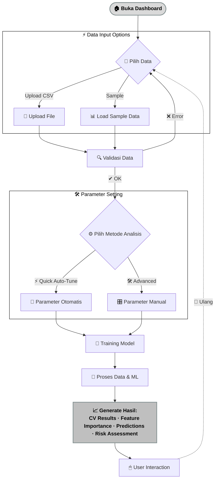

```mermaid
%%{init: {"theme": "default", "themeVariables": {"background":"transparent"}} }%%
flowchart TD
    %% === START ===
    Start([🏠 Buka Dashboard]):::start --> Upload{📂 Pilih Data}
    
    %% === UPLOAD DATA ===
    subgraph InputData [⚡ Data Input Options]
        direction LR
        Upload -->|Upload CSV| File[📝 Upload File]
        Upload -->|Sample| Sample[📊 Load Sample Data]
    end
    
    File --> Validate[🔍 Validasi Data]
    Sample --> Validate
    
    Validate -->|❌ Error| Upload
    Validate -->|✔ OK| Method{⚙️ Pilih Metode Analisis}
    
    %% === METODE ===
    subgraph Param [🛠 Parameter Setting]
        direction LR
        Method -->|⚡ Quick Auto-Tune| Quick[🔧 Parameter Otomatis]
        Method -->|🛠 Advanced| Manual[🎛 Parameter Manual]
    end
    
    Quick --> Train[🤖 Training Model]
    Manual --> Train
    
    Train --> Process[🔄 Proses Data & ML]
    
    %% === HASIL ===
    Process --> Results[📈 Generate Hasil:<br/>CV Results · Feature Importance · Predictions · Risk Assessment]:::results
    
    %% === INTERAKSI ===
    Results --> Interact[🖱 User Interaction]
    Interact -.->|🔄 Ulang| Upload
    
    %% === NETRAL STYLE DEFINITIONS ===
    classDef start fill:#d9d9d9,stroke:#7f8c8d,stroke-width:2px,color:#000,font-weight:bold;
    classDef results fill:#bfbfbf,stroke:#7f8c8d,stroke-width:2px,color:#000,font-weight:bold;

    %% Hilangkan background untuk semua node
    classDef transparent fill:none,stroke:#000,stroke-width:1px,color:#000;
    class * transparent;

    %% Hilangkan background subgraph
    style InputData fill:none,stroke:#000,color:#000
    style Param fill:none,stroke:#000,color:#000

```